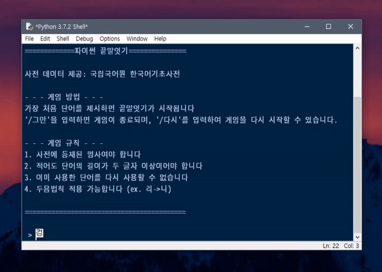

# py_endtoend

한국어기초사전 API를 이용한 간단한 파이썬 끝말잇기 게임 스크립트

## 사용 방법
1. pip 등을 통해 `requests`, `hgtk` 모듈을 설치합니다
2. [한국어기초사전 오픈 API 서비스 소개 페이지](https://krdict.korean.go.kr/openApi/openApiInfo)로 가 API키 발급을 신청합니다
3. 발급받은 API키를 `apikey = 'AAAAAAAAAAAAAAAAAAAAAAAAAAAAAAAA'` 와 같이 넣습니다
4. 스크립트를 실행하면 끄읕

## 참고 사항
- 학교 프로젝트 수행평가로 만들었던 걸 고친거라 코드가 많이 더럽습니다.
- 원래는 표준국어대사전 API를 사용하려 했는데 단어들이 너무 많아서 기초사전을 이용하였습니다. 다만 이게 단어가 알게모르게 부족한 감이 없잖아 있습니다.
- 이 스크립트에서 이용하는  API는 하루에 25,000건만 호출이 가능합니다
